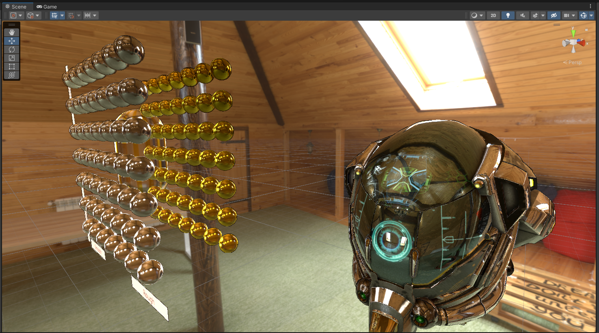
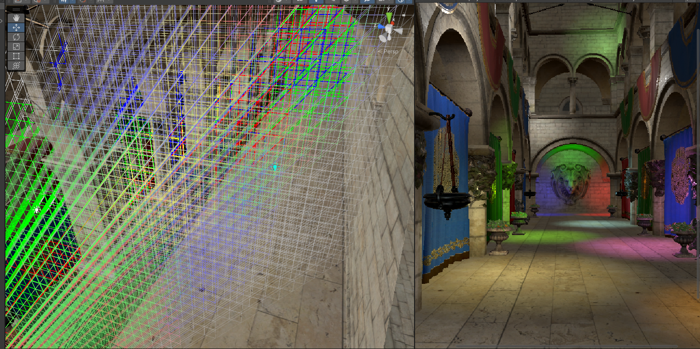
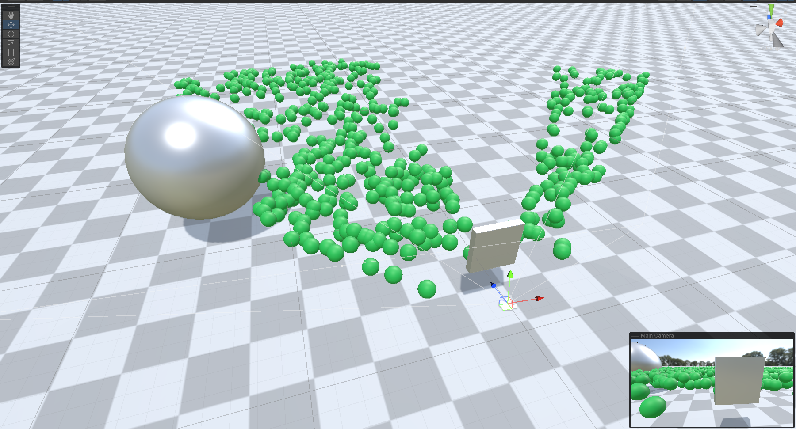
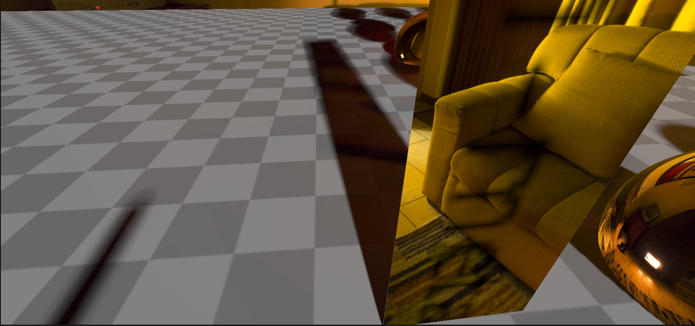
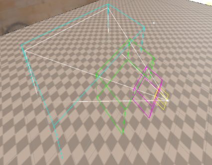

# ToyRenderPipeline
blog gate:https://www.yuque.com/shaozi-3mfdw/vg35e0

基于urp管线实现的延迟PBR渲染，CSM，PCSS，分簇光源，GPUinstance以及compute shader对其剔除
https://www.yuque.com/shaozi-3mfdw/vg35e0/dv1455vk1wms2wk0
https://www.yuque.com/shaozi-3mfdw/vg35e0/cpm6qhha2pxgra23
https://www.yuque.com/shaozi-3mfdw/vg35e0/psnmqyyr7rpz25ge
https://www.yuque.com/shaozi-3mfdw/vg35e0/cxdpo7lw6m15y6qa
https://www.yuque.com/shaozi-3mfdw/vg35e0/rc4k7p3cczf3isay