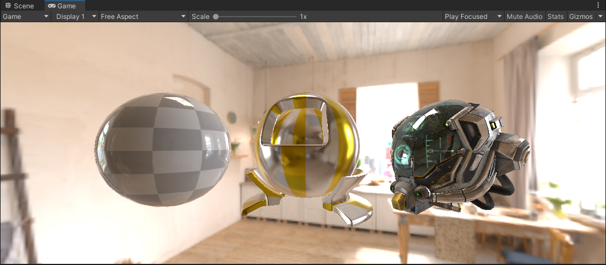
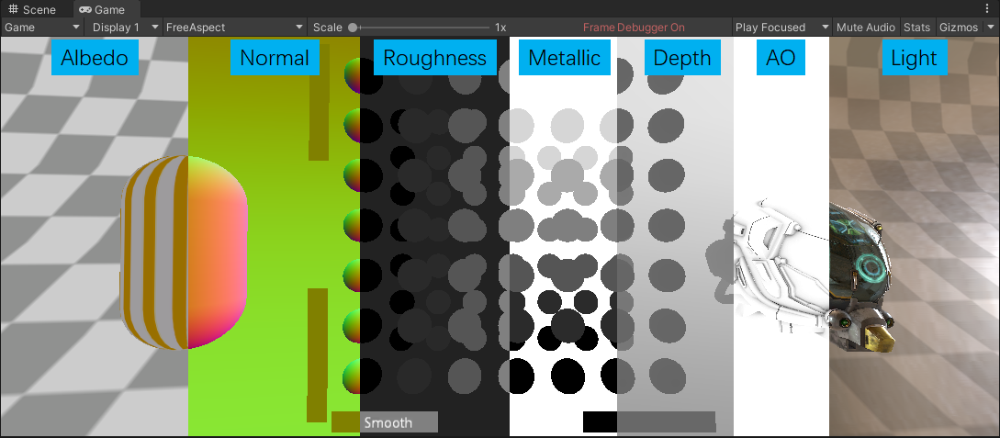
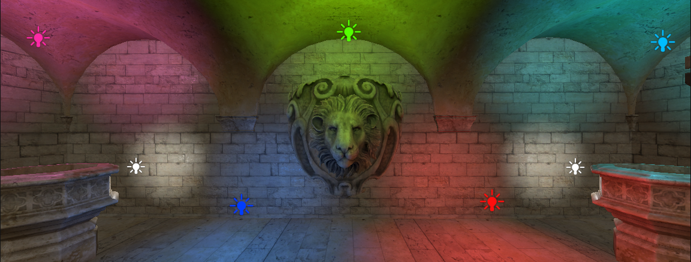
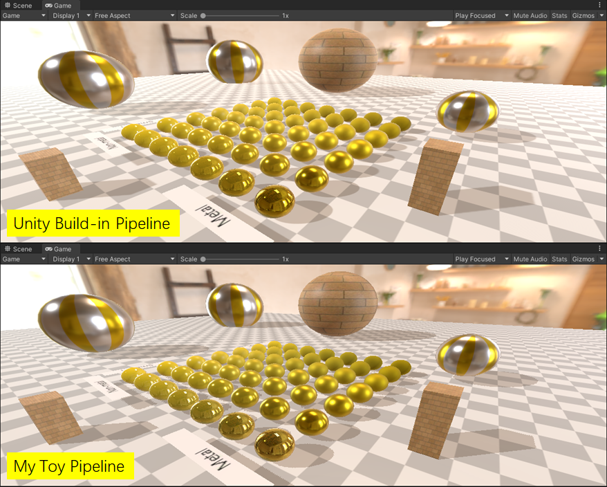

# ToyRenderPipeline

An custom Render Pipeline with Unity SRP（Scriptable Render Pipeline）

# Features

* Deferred Shadings Pipeline
* Physical Based Rendering（PBR，direct light）
* Image Based Lighting（IBL，ambient light）
* glTF Material support
* Cascaded Shadow Mapping（CSM）
* PCSS soft shadow
* Cluster Based Deferred Lighting

# Environment

* Unity 2021.2，win 11，DX 11
* [UniGLTF](https://github.com/ousttrue/UniGLTF) package（alternative，you can config material in Unity Inspector）
* MRT supporting GPU

# Usage

* Menu `Create > RenderPipeline > ToyRenderPipeline`，create a pipeline asset
* Menu `Edit > Project Settings > Graphics`，select the custom pipeline
* Bind `ToyRP/gbuffer` shader to all materials

# Compare With Unity 

Using some tricks trying to align the rendering result to Unity Build-in Pipeline，left column is IBL effect，while right is direction light

# Todo

- [x] Shadow Mapping

- [x] Cluster Shading
- [ ] Screen Space Effect
- [ ] Volumn Effect
- [ ] Post Process

# Reference

[1]  JoeyDeVries, ["Learn OpenGL"](https://learnopengl-cn.github.io/07%20PBR/01%20Theory/)

[2] 王江荣, ["【Unity】SRP简单入门"](https://zhuanlan.zhihu.com/p/378828898)

[3] 銀葉吉祥, ["一起来写Unity渲染管线吧！"](https://zhuanlan.zhihu.com/p/35862626)

[4] MaxwellGeng, ["在Unity里写一个纯手动的渲染管线"](https://zhuanlan.zhihu.com/p/43588045)

[5] Catlike Coding, ["Custom Render Pipeline"](https://catlikecoding.com/unity/tutorials/custom-srp/custom-render-pipeline/)

[6] Unity Manual, ["Scriptable Render Pipeline"](https://docs.unity3d.com/2021.2/Documentation/Manual/ScriptableRenderPipeline.html)

[7] 郭大钦, ["unity build-in管线中的PBR材质Shader分析研究"](https://blog.csdn.net/qq_23936433/article/details/108507640)

[8] 雨轩, ["Unity PBR Standard Shader 实现详解"](https://zhuanlan.zhihu.com/p/137039291)

[9] taecg, ["零基础入门Unity Shader"](https://zhuanlan.zhihu.com/p/46745694)

[10] Tim Cooper, ["Scriptable Render Pipeline Overview"](https://blog.unity.com/technology/srp-overview)

[11] LetMe_See, ["Unity中的CommandBuffer"](https://www.jianshu.com/p/aa9f31e2e345)

[12] EA DICE, ["Moving Frostbite to PBR"](https://seblagarde.files.wordpress.com/2015/07/course_notes_moving_frostbite_to_pbr_v32.pdf)

[13] cinight, ["CustomSRP"](https://github.com/cinight/CustomSRP)

[14] moriya苏蛙可, ["DX12渲染管线(1) - 基于物理的渲染(PBR)"](https://zhuanlan.zhihu.com/p/61962884)

[15] pema99, ["shader-knowledg"](https://github.com/pema99/shader-knowledge/blob/26f609ebd68d0128a268a528e822d15111de354d/mrt.md)

[16] dariomanesku, ["cmftStudio"](https://github.com/dariomanesku/cmftStudio)

[17] BugRunner, ["Cascaded Shadow Map(CSM)中的一些问题"](https://blog.csdn.net/BugRunner/article/details/7366762)

[18] YOung, ["Unity实时阴影实现——Screen Space Shadow Mapping"](https://zhuanlan.zhihu.com/p/45679584)

[19] YOung, ["Unity实时阴影实现——Cascaded Shadow Mapping"](https://zhuanlan.zhihu.com/p/45673049)

[20] richbabe, ["Unity实现Shadow Map"](http://richbabe.top/2018/06/27/%E7%94%A8Unity%E5%AE%9E%E7%8E%B0Shadow-Map/)

[21] Frostbite, ["Shadows & Decals: D3D10 techniques from Frostbite"](https://ubm-twvideo01.s3.amazonaws.com/o1/vault/gdc09/slides/100_Handout%203.pdf)

[22] Microsoft DX Doc, ["Cascaded Shadow Maps"](https://docs.microsoft.com/en-us/windows/win32/dxtecharts/cascaded-shadow-maps)

[23] Microsoft DX Doc, ["Common Techniques to Improve Shadow Depth Maps"](https://docs.microsoft.com/en-us/windows/win32/dxtecharts/common-techniques-to-improve-shadow-depth-maps#moving-the-light-in-texel-sized-increments)

[24] Catlike Coding, ["Directional Shadows Cascaded Shadow Maps"](https://catlikecoding.com/unity/tutorials/custom-srp/directional-shadows/)

[25] 宋开心, ["用DX11实现Cascaded shadow map"](https://zhuanlan.zhihu.com/p/116731971)

[26] opengl-tutorial, ["Tutorial 16 : Shadow mapping"](http://www.opengl-tutorial.org/cn/intermediate-tutorials/tutorial-16-shadow-mapping/)

[27] NVIDIA, ["Percentage-Closer Soft Shadows"](https://developer.download.nvidia.cn/shaderlibrary/docs/shadow_PCSS.pdf)

[28] Vilem Otte, ["Effect: Area Light Shadows Part 1: PCSS"](https://www.gamedev.net/tutorials/programming/graphics/effect-area-light-shadows-part-1-pcss-r4971/)

[29] kakaroto, ["实时渲染｜Shadow Map：PCF、PCSS、VSM、MSM"](https://zhuanlan.zhihu.com/p/369710758)

[30] John R. Isidoro, ["Shadow Mapping: GPU-based Tips and Techniques"](http://amd-dev.wpengine.netdna-cdn.com/wordpress/media/2012/10/Isidoro-ShadowMapping.pdf)

[31] Kevin Myers, ["Integrating Realistic Soft Shadows into Your Game Engine"](https://developer.download.nvidia.cn/whitepapers/2008/PCSS_Integration.pdf)

[32] TheMasonX, ["UnityPCSS"](https://github.com/TheMasonX/UnityPCSS)

[33] xiaOp, ["实时阴影技术总结"](https://xiaoiver.github.io/coding/2018/09/27/%E5%AE%9E%E6%97%B6%E9%98%B4%E5%BD%B1%E6%8A%80%E6%9C%AF%E6%80%BB%E7%BB%93.html)

[34] 闫令琪老师, [“GAMES202-高质量实时渲染”](https://www.bilibili.com/video/BV1YK4y1T7yY)

